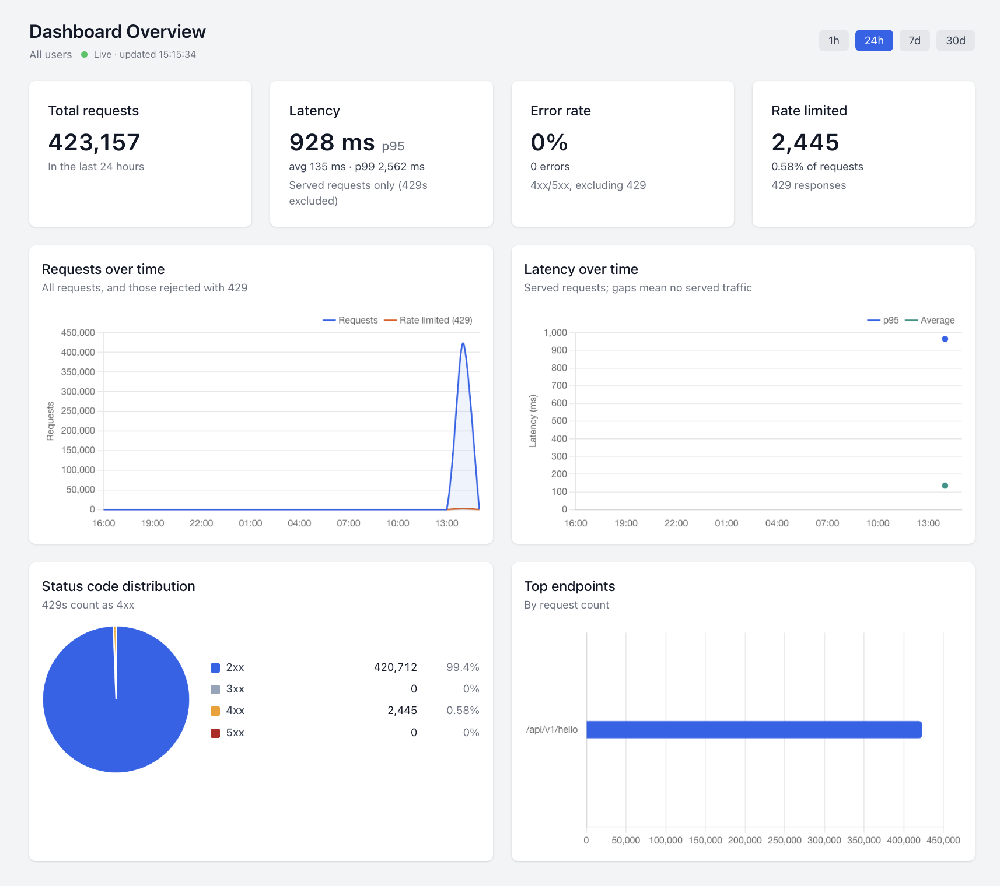
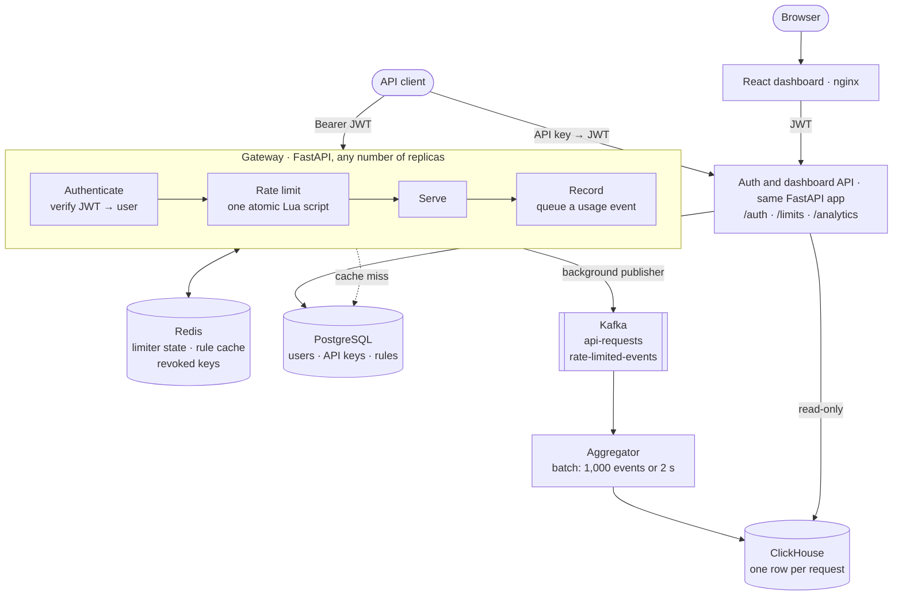

# SentryFlow

**API gateway with distributed rate limiting and real-time usage analytics.**

[](https://github.com/harjeet-chahal/SentryFlow/actions/workflows/ci.yml)
[](LICENSE)

SentryFlow sits in front of an API. It authenticates every call with a
short-lived JWT, which a program gets in exchange for its API key, and checks
the call against that caller's per-endpoint rate limit. The limit is
enforced atomically in Redis, so it holds across any number of gateway
replicas. Every call is then streamed through Kafka into ClickHouse. A React
dashboard shows traffic, latency and throttling seconds after they happen.
Administrators change limits there, and a change applies from the caller's
next request.



<sub>The admin dashboard after a load-test session: 423,157 requests, 2,445
of them throttled, no errors. The latency figures include runs pushed past one
worker's capacity, at 2,000 requests/s, where requests queued for
seconds.</sub>

---

## At a glance

| Result | Details |
| --- | --- |
| **1,500 req/s per worker** | one gateway process, p99 10.5 ms, zero failed requests ([k6](docs/load-testing.md)) |
| **0.7–0.9 ms median overhead** | at 1,000 req/s, over two runs: JWT check, rate-limit check and usage event (p95 1.3–1.9 ms) |
| **Exactly 30 through** | a caller allowed 30 requests sent over 200; exactly 30 succeeded in every load-test run, with either algorithm |
| **≤ 2.2 s to analytics** | from a request to its row in the analytics API |
| **170 bytes vs 4.0 MB** | Redis state for one high-limit caller after 30 s at 1,000 req/s: token bucket vs sliding window |
| **471 tests** | backend coverage 96.0%, aggregator 99.3%, frontend 80.2%; the analytics SQL runs against a real ClickHouse |
| **6 CI jobs per PR** | tests with coverage floors, SQL against ClickHouse, frontend tests and build, Helm lint and `kubeconform -strict`, image builds |

---

## Features

- **Gateway.** Checks a JWT on every call: its signature, its expiry, and
  whether its API key has been revoked since it was issued. A bad token gets
  a `401` before any rate-limit budget is spent. Responses carry
  `X-RateLimit-Limit`, `X-RateLimit-Remaining` and `X-RateLimit-Reset`, and
  every `429` a `Retry-After`.
- **Two rate-limiting algorithms.** The sliding window is exact at the window
  boundary. The token bucket allows bursts and uses constant memory. Each is
  one atomic Redis Lua script.
- **Per-user, per-endpoint rules.** A request matches its exact path, then
  the user's `*` rule, then the global defaults. Admins edit rules in the
  dashboard or through `PUT /limits`, and the change applies from the next
  request.
- **Usage analytics.** Requests, error rate, throttling, average, p95 and p99
  latency, status codes, busiest endpoints, a per-user drill-down and a
  filterable request log, over the last hour, day, week or 30 days.
- **JWTs for people and for programs.** People sign in for dashboard tokens
  (access and refresh). Programs trade an API key for a 15-minute gateway
  token, so the long-lived key is sent once per token rather than with every
  call. Neither kind of token works in the other's place. Users see only
  their own traffic. Admins see everyone's and set the limits.
- **Degrades instead of failing.** If Redis goes down, the limiter fails open
  by default. A Kafka outage loses usage events but never delays requests. If
  ClickHouse goes down, the dashboard loses analytics and the gateway keeps
  serving.

---

## Architecture



### Request path

This is the synchronous part, the only part a caller waits for. Beforehand,
a program trades its API key for a gateway token at `POST /auth/token`, and
again when the token expires 15 minutes later. The key is checked against
Postgres there, once per token rather than on every call.

1. **Authenticate.** The `Authorization: Bearer` token is verified inside
   the gateway: its signature, its expiry, and that it is a gateway token.
   The token names its user, so nothing is looked up. One Redis call checks
   that its API key has not been revoked since. A missing, invalid or
   revoked token gets a `401` here, before it can use up anyone's rate
   limit.
2. **Rate limit.** The caller's rule for this path is resolved and cached in
   Redis for 60 s. Then one Lua script checks and updates the counter in a
   single atomic step. A caller over the limit gets a `429` with
   `Retry-After`.
3. **Serve.** The handler runs, and the rate-limit headers are added to its
   response.
4. **Record.** One usage event goes onto a bounded in-memory queue, and the
   response returns. The request never waits on Kafka.

The gateway's whole overhead is a signature check, three Redis round trips
(revocation, rule, Lua script) and a queue put: a 0.7–0.9 ms median at
1,000 requests/s.

### Analytics path

This part is asynchronous; callers never wait on it.

5. A background task in each gateway process publishes the queued events to
   Kafka. `429`s go to `rate-limited-events` and everything else to
   `api-requests`. Events are keyed by user, so each user's events stay in
   order.
6. The aggregator consumes both topics and writes to ClickHouse in batches: at
   1,000 events or after 2 seconds, whichever comes first. It commits Kafka
   offsets only after a write succeeds, so a crash replays events rather than
   losing them (at-least-once).
7. ClickHouse keeps one raw row per request, in daily partitions with a 90-day
   TTL. Percentiles are computed at query time, so there are no rollup tables
   to keep consistent.
8. The dashboard's analytics API queries ClickHouse over a read-only,
   time-limited connection. The dashboard refreshes every 10 seconds.

### Components

| Component | Built with | Responsibility |
| --- | --- | --- |
| Gateway ([`backend/`](backend)) | Python 3.11, FastAPI, SQLAlchemy, aiokafka | authentication, rate limiting, usage events; also serves the dashboard's API |
| Limiter state and caches | Redis, Lua | rate-limit counters, rule cache, revoked keys |
| Accounts | PostgreSQL (SQLite for local runs and tests) | users, API keys, rate-limit rules |
| Event stream | Kafka in KRaft mode | usage events on two topics |
| Aggregator ([`aggregator/`](aggregator)) | Python, aiokafka, clickhouse-driver | batches events from Kafka into ClickHouse |
| Analytics store | ClickHouse | one row per request, kept 90 days |
| Dashboard ([`frontend/`](frontend)) | React 18, Chart.js, Tailwind, nginx | charts, request log, users, limits, API keys |
| Load tests ([`loadtest/`](loadtest)) | k6 | throughput, limit exactness, analytics freshness |
| Deployment ([`kubernetes/`](kubernetes)) | Docker Compose, Helm | local stack; Kubernetes chart with autoscaling, disruption budget and probes |

---

## Rate limiting

Both algorithms are Redis Lua scripts, so each check-and-update runs as one
atomic step on the Redis server. The same logic in Python would need a
`WATCH`/`MULTI` loop that retries whenever another request changes the key
first, which is exactly what happens under load. Because every gateway replica
shares the same Redis, a limit applies across the whole fleet, not per pod.

| | Sliding window (default) | Token bucket |
| --- | --- | --- |
| Admits | at most *N* requests in any trailing 60 s | a burst up to the bucket's capacity, then *N* per minute |
| Redis state per caller and endpoint | one sorted-set entry per admitted request in the window | two fields |
| Measured key size, high-limit caller, 30 s at 1,000 req/s | 4.0 MB | 170 bytes |
| Measured median latency, 1,000 req/s, two runs each | 0.68–0.93 ms | 0.64–0.80 ms |
| Choose it for | exact enforcement at the boundary | bursts, and high limits at low memory |

A fixed window lets a caller send twice the limit around a window boundary;
the sliding window does not. The cost is memory, one entry per admitted
request, up to the limit itself. The token bucket's memory stays constant, and
its refill is computed from elapsed time when a request arrives rather than on
a timer. Both scripts are deterministic: timestamps and sorted-set members are
passed in as arguments rather than generated in Lua, so they replicate safely.

Rules resolve per user and per endpoint: the exact path, then the user's `*`
rule, then the global defaults. The result is cached in Redis for 60 s, and
misses are cached too, so the database stays off the request path. Changing
or deleting a rule clears that user's cached results, so the new limit applies
from their next request. The full design is in
[docs/rate-limiting.md](docs/rate-limiting.md).

---

## Performance

k6 against the Docker Compose stack on one laptop (Apple M4 Pro), measured on
2026-09-27 with JWT authentication. One gateway process, a single uvicorn
worker, ran alongside Redis, Kafka, ClickHouse and Postgres. The test endpoint
does no work, so these numbers measure the gateway's own overhead. The method
and every run are in [docs/load-testing.md](docs/load-testing.md).

| Offered load | Requests | Median | p95 | p99 | Failed |
| ---: | ---: | ---: | ---: | ---: | ---: |
| 200/s for 60 s | 12,001 | 1.5 ms | 2.6 ms | 4.2 ms | 0 |
| 1,000/s for 30 s, two runs | 30,000; 30,003 | 0.7, 0.9 ms | 1.3, 1.9 ms | 2.8, 4.4 ms | 0 |
| 1,500/s for 30 s | 45,001 | 0.8 ms | 2.8 ms | 10.5 ms | 0 |
| 2,000/s for 30 s | 46,757 served; 13,255 never sent | 0.32 s | 4.0 s | 4.7 s | 0 |

- **One worker saturates between 1,500 and 2,000 requests/s.** Past that
  point requests queue and latency jumps to seconds, so the answer is more
  pods. Limits stay global because every replica shares Redis. The Helm
  chart's autoscaler runs 3–12 gateway replicas by default, 3–20 in the
  production values.
- **Throttling was exact in every run.** A caller allowed 30 requests got
  exactly 30 through, and every other response was a `429` with
  `Retry-After`. Below saturation, the token bucket also passed a refill
  check: a burst admitted exactly 10 requests and, 5.5 seconds later, exactly
  the 5 tokens that had refilled.
- **The load test found a real bug.** bcrypt was hashing passwords on the
  event loop, and each login stalled every in-flight request for about
  200 ms: p99 was 88 ms at just 20 requests/s. Hashing now runs in the
  threadpool, and p99 at 200 requests/s is 4.2 ms.
- **Keeping Kafka off the request path costs almost nothing.** Queueing usage
  events added no measurable latency at 1,000 requests/s and about 0.05 ms to
  the median at 1,500. Before the queue, a Kafka outage held each request for
  up to 40 seconds.
- **JWTs cost about 0.06 ms.** Before them, the gateway looked each API key
  up in Redis. Run before and after the change, alternately, at 1,000
  requests/s, the JWT build's median was 0.06–0.07 ms higher, and p95 and p99
  stayed within run-to-run noise.

---

## Quick start

```bash
SENTRYFLOW_ADMIN_PASSWORD=choose-one docker compose up -d --build
```

This starts the gateway, aggregator and dashboard, plus Postgres, Redis,
Kafka and ClickHouse. A one-shot `migrate` service creates the schema and the
`admin` account. If you leave `SENTRYFLOW_ADMIN_PASSWORD` unset, it generates a
password instead; `docker compose logs migrate` shows it. Sign in as `admin`
to see every user's traffic and edit limits. Accounts created through sign-up
see only their own.

| Service | URL |
| --- | --- |
| Dashboard | http://localhost |
| API docs | http://localhost:8000/docs |
| Kafka UI | http://localhost:8080 (`docker compose --profile tools up -d kafka-ui`) |

If something else already holds a host port, move it with `BACKEND_PORT`,
`DASHBOARD_PORT` and the similar variables listed in
[docs/deployment.md](docs/deployment.md#local-development).

Without Docker, the gateway runs on SQLite, with no analytics unless Kafka and
ClickHouse are running. CI uses Python 3.11 and Node 18:

```bash
pip install -r backend/requirements.txt
python -m backend.setup_db
uvicorn backend.main:app --reload

cd frontend && npm install && npm start
```

### Using the gateway

```bash
# 1. Register and log in (login is form-encoded: the OAuth2 password flow)
curl -X POST localhost:8000/auth/signup \
  -H 'Content-Type: application/json' \
  -d '{"username":"demo","email":"demo@example.com","password":"demo-password"}'

TOKEN=$(curl -s -X POST localhost:8000/auth/login \
  -d 'username=demo&password=demo-password' | python3 -c 'import json,sys;print(json.load(sys.stdin)["access_token"])')

# 2. Create an API key
KEY=$(curl -s -X POST localhost:8000/auth/apikeys/create \
  -H "Authorization: Bearer $TOKEN" -H 'Content-Type: application/json' \
  -d '{"name":"demo-key"}' | python3 -c 'import json,sys;print(json.load(sys.stdin)["key"])')

# 3. Trade the key for a gateway token (valid for 15 minutes)
GATEWAY_TOKEN=$(curl -s -X POST localhost:8000/auth/token -H "x-api-key: $KEY" \
  | python3 -c 'import json,sys;print(json.load(sys.stdin)["access_token"])')

# 4. Call through the gateway
curl -i localhost:8000/api/v1/hello -H "Authorization: Bearer $GATEWAY_TOKEN"
```

The response carries `X-RateLimit-Limit`, `X-RateLimit-Remaining` and
`X-RateLimit-Reset`. By default a user may make 60 requests a minute to each
endpoint; the 61st gets a `429` with `Retry-After`. The whole API is in
[docs/api.md](docs/api.md).

---

## Tests

From the repository root:

```bash
cd backend && pytest          # gateway, auth, limiter, analytics API
cd aggregator && pytest       # Kafka -> ClickHouse ingestion
cd frontend && npm test       # dashboard pages, hooks and helpers
make test-integration         # analytics SQL; needs a ClickHouse, e.g. the compose one
```

| Suite | Tests | Coverage |
| --- | ---: | ---: |
| Backend | 325 | **96.0%** of statements and branches (CI fails below 90%) |
| Analytics SQL, against a real ClickHouse | 11 | — |
| Aggregator | 32 | **99.3%** (CI fails below 90%) |
| Frontend | 103 | 80.2% of statements, 74.4% of branches |
| **Total** | **471** | |

The unit suites need no running services. Postgres is replaced by SQLite, and
Redis by `fakeredis`, which runs the real Lua scripts, so the limiter
algorithms themselves are under test. Kafka is replaced by a recording double,
and ClickHouse by canned rows per named query. Canned rows cannot prove the
SQL correct, so `backend/tests/integration` runs every analytics query against
a real ClickHouse with known events and checks the numbers. CI runs it with a
ClickHouse service container.

The backend's coverage is understated by a couple of points. The coverage
tracer stops following a coroutine at its first `await`, so lines after it
read as uncovered even though `tests/test_gateway.py` drives them over HTTP.

Beyond the happy paths, the suites cover:

- sliding-window behaviour at the window boundary;
- token-bucket refill, and the cap at the bucket's capacity;
- failing open, and failing closed, when Redis is down;
- refresh tokens rejected as access tokens, and forged or expired tokens;
- gateway and dashboard tokens each refused in the other's place, and
  unsigned (`alg: none`) tokens refused;
- per-user data scoping and admin-only writes;
- paging through users without loading every account;
- a changed limit applying on the very next request;
- a revoked key's tokens failing on the very next request, even with Redis
  down;
- a stalled Kafka broker not slowing callers, and reconnecting to a Kafka that
  starts late;
- the aggregator committing offsets only after its writes (at-least-once);
- password hashing and database queries staying off the event loop.

---

## Deployment

The Helm chart is in [`kubernetes/chart`](kubernetes/chart), and the full
guide is [docs/deployment.md](docs/deployment.md).

```bash
helm upgrade --install sentryflow ./kubernetes/chart \
  --namespace sentryflow --create-namespace \
  -f ./kubernetes/chart/values-production.yaml \
  --set image.tag=$(git rev-parse --short HEAD) --wait
```

The chart renders:

- the gateway, with a horizontal pod autoscaler, a disruption budget that
  keeps 2 pods up during node drains, and pods spread across zones;
- the aggregator and the dashboard;
- an optional Ingress;
- a pre-install and pre-upgrade Job that runs the idempotent migration.

`values-production.yaml` targets AWS EKS, with RDS, ElastiCache, MSK, ECR and
an ALB in place of the in-cluster services. Pods get AWS access through IRSA
rather than static keys. Secrets live in AWS Secrets Manager, and External
Secrets Operator copies them into the cluster. CI lints the chart and
validates every rendered manifest against the Kubernetes 1.29 schemas with
`kubeconform -strict`.

---

## Design decisions

**Liveness checks nothing.** `/health/live` touches no dependency. A liveness
probe that checked Redis would restart every pod during a Redis blip, turning
a degraded dependency into an outage. `/health/ready` checks Postgres and
Redis, so an affected pod leaves the Service and rejoins on recovery without
restarting.

**Kafka is non-critical and off the request path.** A request only puts its
usage event on a bounded in-memory queue, holding 10,000 events per process.
A background task owns the producer and publishes from that queue. Awaiting the
producer inside the request would let a broker outage reach callers: with the
broker down, aiokafka's `send()` blocks for 40 s once a partition's buffer
fills. The queue rides out an outage; once it is full, new events are dropped
and counted in `/health`. The task reconnects with backoff, so a pod that
boots before Kafka starts publishing when Kafka arrives. A broker outage
costs analytics events, never requests. That is the right trade for usage data
and would be the wrong one for billing.

**The limiter fails open.** If Redis is unreachable, requests are served
without enforcement (`RATE_LIMIT_FAIL_OPEN`, default `true`). Losing the rate
limiter should degrade enforcement, not cause an API outage. Authentication,
by contrast, never fails open: if Redis cannot answer the revocation check,
the gateway asks the database whether the token's key is still active, which
is slower but still correct.

**No secrets in source.** The JWT signing key is read from the environment.
When `ENVIRONMENT=production` and `JWT_SECRET` is unset, the application
refuses to boot rather than fall back to a default. In development it
generates a temporary key.

**Gateway calls carry a short-lived JWT, not the API key.** A program
trades its key for a 15-minute token at `/auth/token`. The long-lived secret
then crosses the network once per token rather than with every call, and a
token that leaks is good for minutes. The token names its user and is
verified in-process, so authenticating a request needs no database lookup and
no cache of keys. Dashboard tokens are signed with the same key; a `type`
claim keeps each kind out of the other's routes.

**Revocation and limit changes apply on the next request.** A JWT cannot be
withdrawn before it expires. So revoking a key also records its id in Redis
for as long as its tokens could still be valid, and the gateway checks that
list on every call. The check is one Redis round trip, the one the old
per-request key lookup used. If Redis loses the list, a revoked key's tokens
keep working until they expire, 15 minutes at most. Changing or deleting a
rate-limit rule likewise evicts the cached rule.

**Operators set limits, customers do not.** Anyone can read the limits that
apply to them, but only admins can change them; a customer who could raise
their own limit would not really have one. Users see only their own traffic,
and asking for someone else's is a `403`, not an empty result.

**Analytics are computed at query time.** The aggregator writes raw events
and ClickHouse aggregates them when queried. Percentiles cannot be rebuilt
from pre-aggregated percentiles, and without rollup tables there is nothing to
keep consistent. The dashboard's ClickHouse connection is read-only and has a
query time limit.

**Nothing slow on the event loop.** bcrypt, database queries and ClickHouse
queries run in the threadpool. Routes with no async work are plain `def`
functions, which FastAPI runs in the threadpool, and async routes hand their
queries to it. `tests/test_event_loop.py` fails if any route runs SQL on the
event loop.

---

## Project layout

```
backend/            FastAPI gateway and dashboard API
  main.py             the middleware chain: authenticate → rate limit → serve → record
  limiter/            Lua scripts, rule resolution, the /limits API
  middlewares/        gateway tokens and revocation, the Kafka usage publisher
  analytics/          ClickHouse queries behind /analytics
  auth/               sign-up, JWT login, API keys and the token exchange, user directory
  health_check.py     /health, /health/ready, /health/live
aggregator/         Kafka → ClickHouse batch consumer, and the table schema
frontend/           React dashboard, served by nginx
loadtest/           k6 scenarios: steady, throttle, refill, freshness
kubernetes/chart/   Helm chart
docs/               API, rate limiting, analytics, load testing, deployment
```

## Documentation

- [API reference](docs/api.md): every endpoint, its credentials and its errors
- [Rate limiting](docs/rate-limiting.md): the algorithms, rules, caching and
  failure modes
- [Analytics pipeline](docs/analytics.md): from request to event, batch, row
  and chart
- [Load testing](docs/load-testing.md): the method, every run, and what the
  runs found
- [Deployment](docs/deployment.md): Compose, Helm, EKS and operations

## License

MIT. See [LICENSE](LICENSE).
